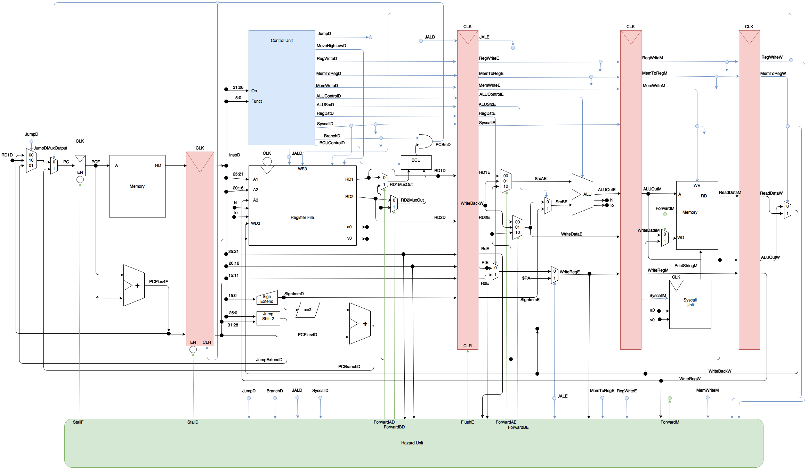

# Pipelined MIPS CPU
_**Team:**_ ManBearPig

_**Members:**_

- Sam Greenberg
- Jordan Sechler
- Lukas Munoz
- Eric Marshall

## Running the Processor
### Programs
The ManBearPig processor supports Hello World and Fibonacci in full. Merge sort is partially implemented, but still contains several bugs.

Programs can be run with `./scripts/run.sh <program>` where `<program>` is one of:

- `hello` - (Hello World)
- `fibonacci` - (Fibonacci)
- `mergesort` - (Merge Sort)

### Tests
15 of the 18 modules used in the ManBearPig processor have associated unit tests, and there are also integration tests for adding, jumping and branching.

Tests can be run with `./scripts/run.sh test <test>` where `<test>` is one of:

- `branch` - (Branching Tests)
- `jump` - (Jumping Tests)
- `add` - (Add Test)
- `unit` - (Unit Test Suite)

## Directory Structure
Overall directory structure of the project

- `includes` - The MIPS header file with size & value macros
- `modules` - All submodules used within the processor
- `processor` - The main processor file
- `programs` - Contains the main 3 programs
    - `fibonacci` - Fibonacci MIPS & binary
    - `hello_world` - Hello World MIPS & binary
    - `mergesort` - Merge sort MIPS & binary
- `scripts` - Scripts to run the processor and unit tests
- `tests` - Overall testing directory
    -   `integration` - Integration tests
    -   `unit` - Unit tests

## Diagram

